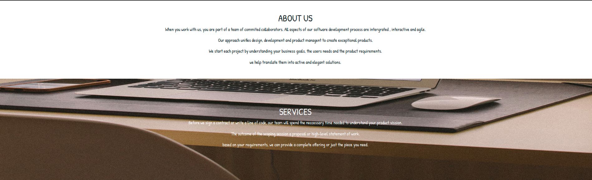
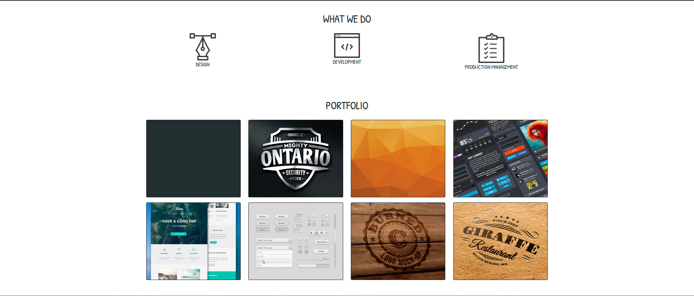
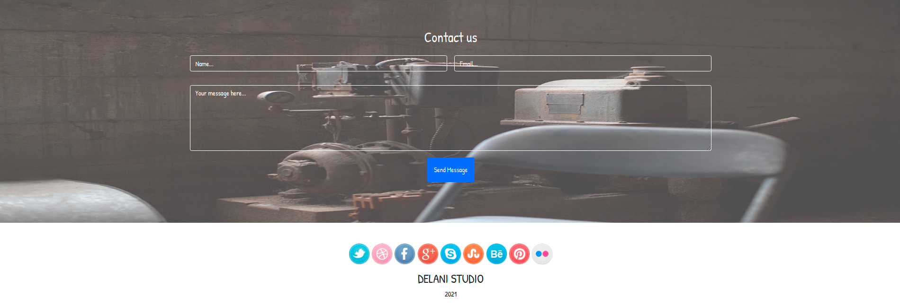

# DELANI STUDIO

[Check it out](https://ikinoti.github.io/delani-studio/)

## Author.

> Kinoti Gitonga
> ​

## Description.

A webpage for Delani studio which gives a detailed account about what they are, the services they offer, projects done so far and a contact page that the user can reach them to.

## Screenshots

## Setup Requirements

> Git

> Web-browser

> Github

## Setup Installation

> copy the github repo https://github.com/ikinoti/delani-studio.git

> git clone the repo to your computer

> Double click index.html to see the code and start working on it.

    ​

## Technologies used.

- Html5
- Bootstrap
- Css
- Javascript
- Jquery
  ​

## Known Bugs

- I haven't encountered any bugs.
  ​

## License

> MIT License &copy 2021 Kinoti Gitonga
> ​

## Collaborate

To collaborate, reach me on [Email](isaiah.gitonga@student.moringaschool.com)
